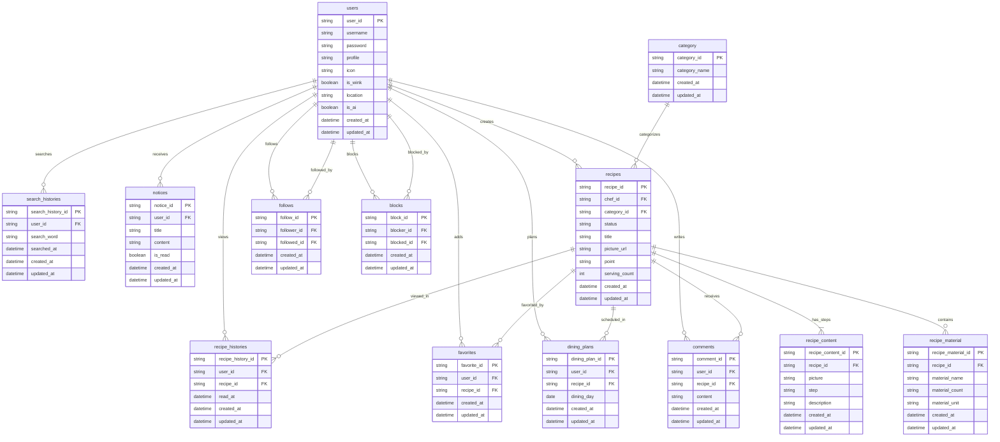

## DB 定義

```mermaid
erDiagram
  users {
    string user_id PK
    string username
    string password
    string profile
    string icon
    boolean is_wink
    string location
    boolean is_ai
    datetime created_at
    datetime updated_at
  }
  search_histories {
    string search_history_id PK
    string user_id FK
    string search_word
    datetime searched_at
    datetime created_at
    datetime updated_at
  }
  recipe_histories {
    string recipe_history_id PK
    string user_id FK
    string recipe_id FK
    datetime read_at
    datetime created_at
    datetime updated_at
  }
  notices {
    string notice_id PK
    string user_id FK
    string title
    string content
    boolean is_read
    datetime created_at
    datetime updated_at
  }
  category {
    string category_id PK
    string category_name
    datetime created_at
    datetime updated_at
  }
  recipes {
    string recipe_id PK
    string chef_id FK
    string category_id FK
    string status
    string title
    string picture_url
    string point
    int serving_count
    datetime created_at
    datetime updated_at
  }
  recipe_material {
    string recipe_material_id PK
    string recipe_id FK
    string material_name
    string material_count
    string material_unit
    datetime created_at
    datetime updated_at
  }
  recipe_content {
    string recipe_content_id PK
    string recipe_id FK
    string picture
    string step
    string description
    datetime created_at
    datetime updated_at
  }
  favorites {
    string favorite_id PK
    string user_id FK
    string recipe_id FK
    datetime created_at
    datetime updated_at
  }
  dining_plans {
    string dining_plan_id PK
    string user_id FK
    string recipe_id FK
    date dining_day
    datetime created_at
    datetime updated_at
  }
  follows {
    string follow_id PK
    string follower_id FK
    string followed_id FK
    datetime created_at
    datetime updated_at
  }
  comments {
    string comment_id PK
    string user_id FK
    string recipe_id FK
    string content
    datetime created_at
    datetime updated_at
  }
  blocks {
    string block_id PK
    string blocker_id FK
    string blocked_id FK
    datetime created_at
    datetime updated_at
  }
  
  users ||--o{ search_histories : "searches"
  users ||--o{ recipe_histories : "views"
  users ||--o{ notices : "receives"
  users ||--o{ favorites : "adds"
  users ||--o{ dining_plans : "plans"
  users ||--o{ follows : "follows"
  users ||--o{ follows : "followed_by"
  users ||--o{ comments : "writes"
  users ||--o{ blocks : "blocks"
  users ||--o{ blocks : "blocked_by"
  users ||--o{ recipes : "creates"
  recipes ||--o{ favorites : "favorited_by"
  recipes ||--o{ dining_plans : "scheduled_in"
  recipes ||--o{ comments : "receives"
  recipes ||--o{ recipe_histories : "viewed_in"
  recipes ||--|{ recipe_content : "has_steps"
  recipes ||--o{ recipe_material : "contains"
  category ||--o{ recipes : "categorizes"
```