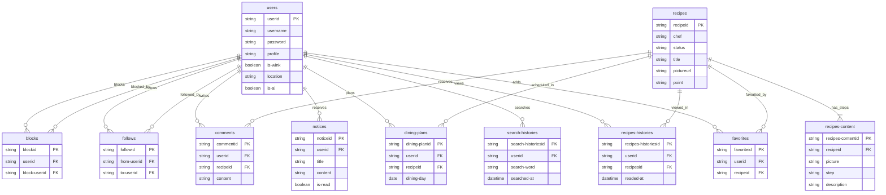

## DB 定義

```mermaid
erDiagram
  users {
    string userid PK
    string username
    string password
    string profile
    boolean is-wink
    string location
    boolean is-ai
  }
  search-histories {
    string search-historiesid PK
    string userid FK
    string search-word
    datetime searched-at
  }
  recipes-histories {
	  string recipes-historiesid PK
	  string userid FK
	  string recipesid FK
	  datetime readed-at
  }
  notices {
    string noticeid PK
    string userid FK
    string title
    string content
    boolean is-read
  }
  recipes {
    string recipeid PK
    string chef
    string status
    string title
    string pictureurl
    string point
  }
  recipes-content {
    string recipes-contentid PK
    string recipeid FK
    string picture
    string step
    string description
  }
  favorites {
    string favoriteid PK
    string userid FK
    string recipeid FK
  }
  dining-plans {
    string dining-planid PK
    string userid FK
    string recipeid FK
    date dining-day
  }
  follows {
    string followid PK
    string from-userid FK
    string to-userid FK
  }
  comments {
    string commentid PK
    string userid FK
    string recipeid FK
    string content
  }
  blocks {
    string blockid PK
    string userid FK
    string block-userid FK
  }
  
  users ||--o{ search-histories : "searches"
  users ||--o{ recipes-histories : "views"
  users ||--o{ notices : "receives"
  users ||--o{ favorites : "adds"
  users ||--o{ dining-plans : "plans"
  users ||--o{ follows : "follows"
  users ||--o{ follows : "followed_by"
  users ||--o{ comments : "writes"
  users ||--o{ blocks : "blocks"
  users ||--o{ blocks : "blocked_by"
  recipes ||--o{ favorites : "favorited_by"
  recipes ||--o{ dining-plans : "scheduled_in"
  recipes ||--o{ comments : "receives"
  recipes ||--o{ recipes-histories : "viewed_in"
  recipes ||--|{ recipes-content : "has_steps"
```